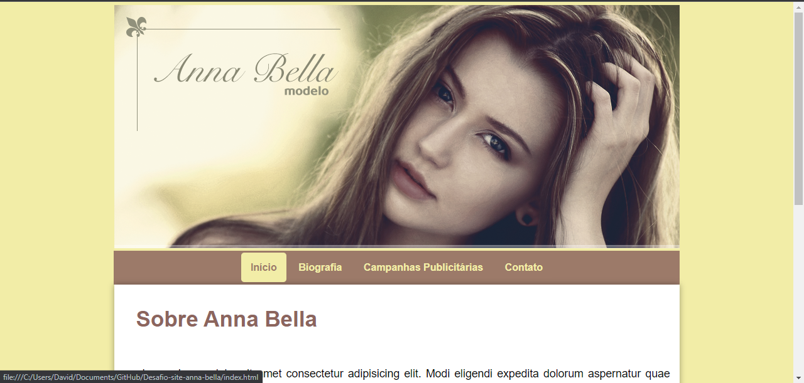
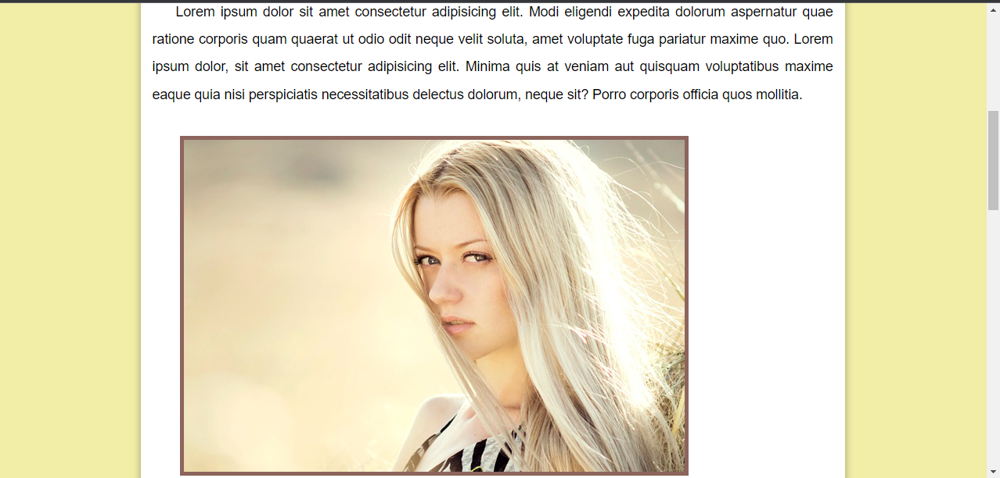

# Desafio-Site-Anna-Bella

O site conta com um menu de navegação que contém 4 páginas, a inicial, biografia, campanhas publicitárias e contato, além de se adpatar a diferentes tamanhos de tela.

### Biografia:
Página com a história da modelo.

### Campanhas Publicitárias:
Página com a descrição e imagens dos trabalhos da modelo, as imagens também se adaptam ao tamanho da tela.

### Contato:
Página com instruções de como entrar em contato com a modelo.

## Feito Com:

Copyright © DavidWillian

